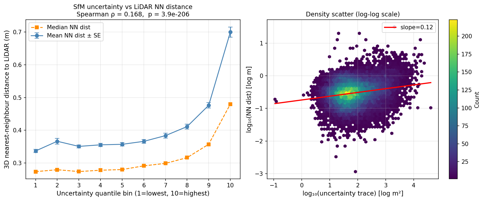

# SfM Uncertainty

End-to-end pipeline for propagating keypoint localization uncertainty through Structure-from-Motion bundle adjustment to per-3D-point covariance matrices, validated against airborne LiDAR ground truth.

---

## What it does

Standard SfM treats every keypoint observation as equally reliable. This project propagates **per-keypoint 2D position uncertainty** (derived from the DoG pyramid Hessian) through bundle adjustment so that the resulting 3D point cloud carries calibrated covariance matrices. Points in ambiguous regions — low texture, motion blur, oblique viewing angles — receive larger covariances that predict their actual positional error.

---

## Pipeline overview

```
Images
  │
  ├─ sfm_cov (C++)          Per-keypoint 2×2 covariance from DoG Hessian (Zeisl 2009)
  │    └──> .cov files       Σ_2D = σ²_n · (−H)⁻¹  at each SIFT keypoint
  │
  ├─ OpenMVG                 Feature matching, global SfM reconstruction
  │    └──> sfm_data.bin
  │
  ├─ ba_ceres (C++)          Bundle adjustment with Mahalanobis-weighted reprojection error
  │    │                     Whitens residuals by L⁻¹ (Cholesky of Σ_2D)
  │    │                     so ‖L⁻¹e‖² ≡ eᵀΣ_2D⁻¹e per observation.
  │    │                     After convergence: fixes camera poses, extracts
  │    │                     per-point covariance via ceres::Covariance (SPARSE_QR).
  │    └──> reconstruction.csv   x y z  cov00..cov22  (SfM frame)
  │
  ├─ gcp_umeyama.py          7-DOF Umeyama similarity: SfM frame → UTM
  │    │                     Triangulates 11 GCPs from archived pixel observations.
  │    │                     Transforms covariances:  Σ_utm = s² R Σ_sfm Rᵀ
  │    └──> reconstruction_aligned.csv   (UTM, metres)
  │
  ├─ lidar_validation.py     3D nearest-neighbour to 12.4 M airborne LiDAR points
  │    └──> validation.csv   nn_dist_m  uncertainty_trace_m²
  │
  └─ plot_validation.py      Binned uncertainty vs NN distance + log-log density scatter
       └──> validation_plot.png
```

---

## Keypoint covariance estimation (Zeisl 2009)

For each SIFT keypoint at `(x, y, σ)`:

1. Locate the keypoint in the DoG pyramid (octave, interval).
2. Compute a weighted 2×2 Hessian `H` of the DoG image using a 3×3 Gaussian kernel.
3. Invert: `Σ_2D = (−H)⁻¹`, then scale back to image coordinates.
4. Keypoints where `H` is indefinite or `Σ_2D` is not positive-definite fall back to the identity (isotropic unit covariance).

The covariance encodes the curvature of the DoG peak — a sharp, well-localised keypoint gets a small covariance; a flat or elongated extremum gets a large, anisotropic one.

---

## Bundle adjustment with covariance weighting

`src/ba_ceres.cpp` builds a Ceres problem where each reprojection residual is whitened by `L⁻¹` (the inverse Cholesky factor of `Σ_2D`):

```
residual = L⁻¹ · (projected − observed)
```

Minimising `‖residual‖²` is equivalent to minimising the Mahalanobis distance `eᵀΣ_2D⁻¹e`, so less-certain keypoints exert proportionally less pull on the solution.

After convergence, all camera poses are fixed and `ceres::Covariance` (SPARSE_QR) extracts the marginal 3×3 covariance of each 3D point:

```
Σ_X = [Σᵢ Jᵢᵀ Σ_2D,i⁻¹ Jᵢ]⁻¹
```

where `Jᵢ` is the Jacobian of the reprojection of point X in view i. This is the formal propagation of image-space uncertainty to object space.

---

## Geo-registration

11 ground control points with surveyed UTM coordinates are triangulated from archived pixel observations using DLT. A 7-DOF Umeyama similarity transform (`gcp_umeyama.py`) maps the SfM reconstruction into UTM:

| Statistic | Value |
|-----------|-------|
| GCPs used for fit | 9 (2 excluded: on elevated structures) |
| GCP RMSE | **0.41 m** |
| Scale | 427.7 m/unit |

Covariances transform as `Σ_utm = s² R Σ_sfm Rᵀ` (rotation preserves shape; scale² inflates magnitudes).

---

## Validation against airborne LiDAR

LiDAR reference: Titan ALS scan, 12.4 million points over the University of Houston campus.

For each of 32,699 geo-registered SfM points inside the LiDAR footprint, the 3D nearest-neighbour distance to LiDAR is computed and compared to the uncertainty trace `tr(Σ_utm) = σ²_X + σ²_Y + σ²_Z`.

| Metric | Value |
|--------|-------|
| Points compared | 32,699 |
| Median NN distance | **0.30 m** |
| 90th percentile NN | 0.82 m |
| Spearman ρ (trace vs NN dist) | **0.168** (p ≈ 0) |

**Spearman ρ = 0.168** confirms that the uncertainty estimates predict actual positional error: points assigned higher covariance are systematically farther from the LiDAR surface, even though the covariances were never calibrated against LiDAR during estimation.

The decile table shows a monotone trend — median NN distance rises from 0.27 m in the lowest-uncertainty tenth to 0.48 m in the highest:

| Uncertainty decile | Median NN distance (m) |
|--------------------|------------------------|
| 1 (lowest) | 0.274 |
| 2 | 0.279 |
| 3 | 0.274 |
| 4 | 0.278 |
| 5 | 0.280 |
| 6 | 0.291 |
| 7 | 0.299 |
| 8 | 0.316 |
| 9 | 0.357 |
| 10 (highest) | **0.480** |



*Left: mean and median LiDAR NN distance by uncertainty decile (lowest to highest). Right: log-log density scatter with linear fit (slope 0.12), confirming the positive correlation across the full dynamic range.*

---

## Known limitation: covariance scale calibration

The Zeisl Σ_2D is proportional to an unknown noise scale σ²_n that Zeisl himself acknowledged must be determined empirically. In this implementation σ²_n = 1 (uncalibrated). The consequence:

- The **ranking** of uncertainties is correct (Spearman ρ > 0, monotone decile table).
- The **absolute magnitudes** are not calibrated. The a posteriori reference variance σ²₀ = VᵀPV/(m−n) is computed after BA (printed as a diagnostic) but is not applied — doing so made results significantly worse because the Zeisl covariances are already over-scaled relative to actual reprojection errors on this dataset.

Calibrating σ²_n against a synthetic dataset with known ground truth is the next step.

---

## Build

Dependencies: OpenCV 4, OpenMVG (installed at `/usr/local`), Ceres Solver, Eigen3.

```bash
cd build
cmake .. -DCMAKE_BUILD_TYPE=Release
make -j$(nproc)
# Produces: build/sfm_cov  build/ba_ceres
```

### Run sfm_cov (keypoint covariance estimation)

```bash
# For each image, writes <image>.cov alongside it
./build/sfm_cov path/to/image.JPG

# With a .feat file to align covariance indices with OpenMVG features:
./build/sfm_cov path/to/image.JPG path/to/image.feat
```

`.cov` format (one line per keypoint, index-aligned with `.feat`):
```
x y scale cov00 cov01 cov10 cov11
```

### Run ba_ceres (bundle adjustment + covariance extraction)

```bash
./build/ba_ceres \
    path/to/sfm_data.bin \
    path/to/matches/ \
    path/to/images_with_cov_files/ \
    path/to/output/reconstruction.csv
```

Output CSV: `x y z cov00 cov01 cov02 cov11 cov12 cov22` (upper triangle of 3×3 covariance, SfM frame).

---

## Repository layout

```
src/
  main.cpp              sfm_cov entry point
  ba_ceres.cpp          Ceres BA with Mahalanobis weighting + covariance extraction
  camera_intrinsics.h   Hardcoded intrinsics for the aerial camera
  zeisl/                CovEstimator class (Zeisl 2009 DoG Hessian method)

scripts/
  gcp_umeyama.py        GCP triangulation + 7-DOF Umeyama geo-registration
  lidar_validation.py   LiDAR nearest-neighbour validation
  plot_validation.py    Validation plots
  synthetic_validation.py  χ²(3) calibration test on Blender synthetic dataset

output/
  reconstruction_filtered.csv   SfM-frame points (outliers removed)
  reconstruction_aligned.csv    UTM-frame points + covariances
  validation.csv                NN distances + uncertainty traces
  validation_plot.png           Validation figure
```

---

## References

- Zeisl, B., Georgel, P., Schweiger, F., Steinbach, E., & Navab, N. (2009). *Estimation of Location Uncertainty for Scale Invariant Feature Points.* BMVC.
- Umeyama, S. (1991). *Least-squares estimation of transformation parameters between two point patterns.* TPAMI.
- Agarwal, S. et al. *Ceres Solver.* http://ceres-solver.org
- Moulon, P. et al. *OpenMVG.* https://github.com/openMVG/openMVG
